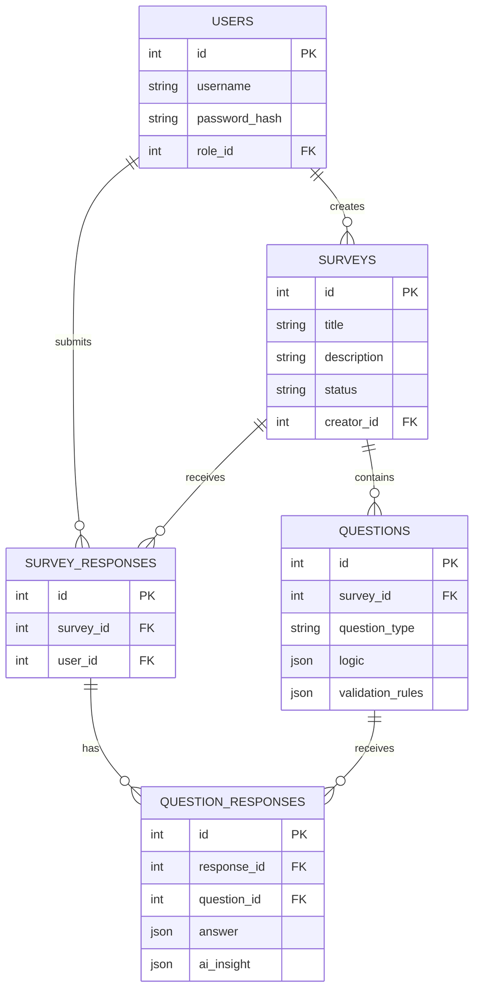

# Architecture

InsightFlow utilizes a modern three-tier architecture with an asynchronous AI pipeline.

## System Components

1. **Frontend (React / Vite)**
   - Single Page Application (SPA) providing the BI Dashboard, Survey Builder, and Survey Execution engine.
   - Communicates securely with the Backend via JWT.
2. **Backend (Node.js / Express)**
   - The core orchestrator. Handles Authentication, Survey logic, and BI aggregations.
3. **Database (MySQL)**
   - Stores relational data (Users, Surveys) and schemaless JSON data (Logic, Validation Rules, AI Insights).
4. **AI Service (Python / Flask)**
   - A lightweight microservice specifically for Natural Language Processing (NLP).

## Mermaid Diagrams

### 1. System Architecture

```mermaid
graph TD
    Client[Client Browser (React)] -->|HTTPS / REST| NodeAPI[Node.js Backend API]
    NodeAPI -->|SQL Queries| DB[(MySQL Database)]
    NodeAPI -->|POST /api/analyze| PythonAI[Python AI Service]
```

### 2. Entity Relationship (ER) Diagram


